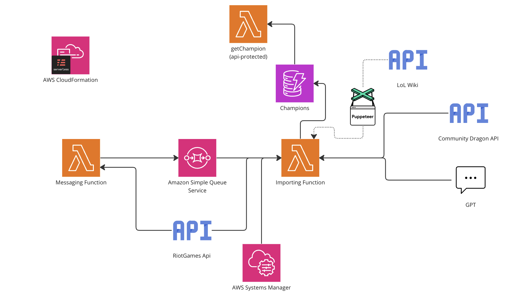

## Accurate LoL Data

### Serverless
I'm using the serverless framework to build the cloudformation scrript to deploy the AWS resources.

### AWS Resources

#### Messaging Function
Messaging Function on a cron job to fetch the latest version from the riot games API, check with the database to see if that version has already been pushed. If it hasn't then fetch all champions from the riot games api and send one message per champion to the SQS. If it has then return 200.

#### Importing Function
Importing Function takes a message which includes a version, champion id and champion key. It uses this information to call the relevant json data from the riot games api and community dragon api. It then merges these json objects together with the use of GPT to generate a final champion version and put it in a dynamoDB database.